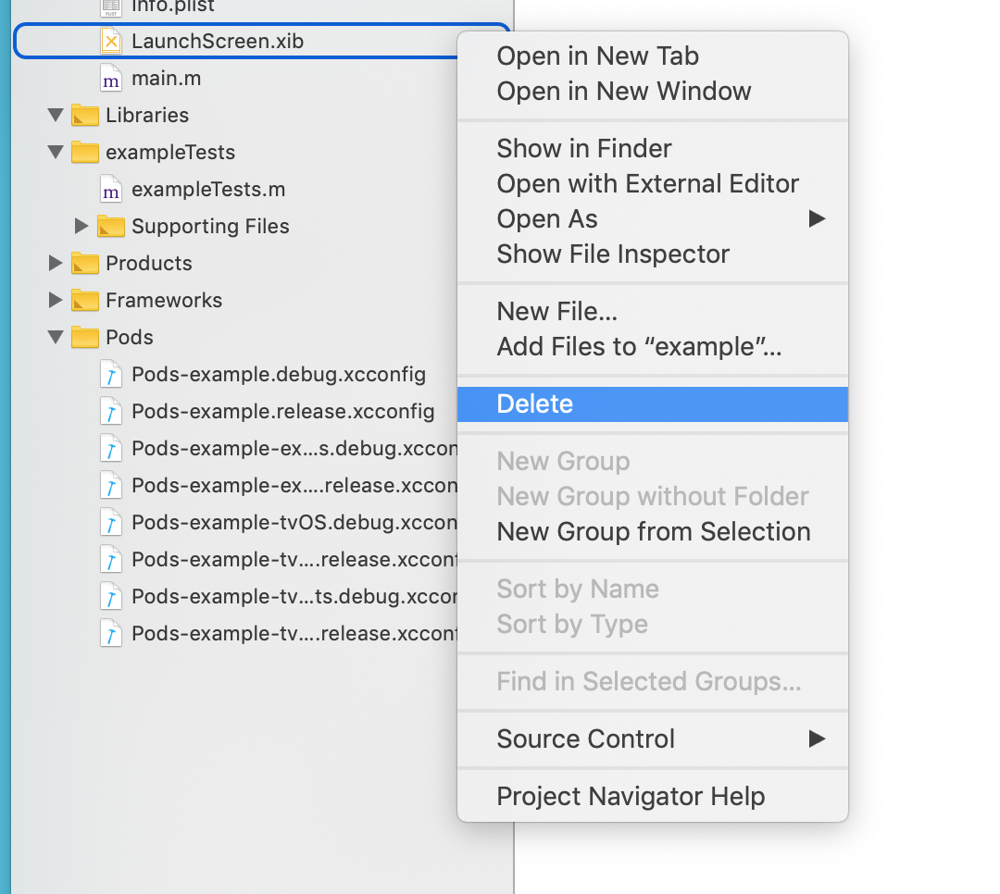

## Getting Started Ios

Install the library using either **Yarn**:

    yarn add rnative-splash
    
__(or)__

For **npm** use

    npm install rnative-splash --save


If using **cocoapods** in the `ios/` directory run

    cd ios
    pod install

**NOTE:** *If you ever need to uninstall **rnative-splash**, run `react-native unlink rnative-splash` to **unlink** it.*


## Installation (Ios)

This line is `[RCTSplashScreen open: rootView withImageNamed: @" splash "];` Add before the `rootView.backgroundColor` line.

In `AppDelegate.m` 

```objc

...
#import "RCTSplashScreen.h" //import interface
...

[RCTSplashScreen open:rootView withImageNamed:@"splash"]; // <-- activate splash, imagename from LaunchScreen.xib

rootView.backgroundColor = [[UIColor alloc] initWithRed:1.0f green:1.0f blue:1.0f alpha:1];

... 

return YES
```

## Xcode Steps

The following changes are required for **xcode**.

### Step 1

Delete your project's `LaunchScreen.xib`



### Step 2

Let's move the **SplashScreenResource** folder under the `ios/` folder.

    
    cp -R ./node_modules/rnative-splash/ios/SplashScreenResource ios/

Drag **SplashScreenResource** folder to your project if you want change image, replace **splash.png** or add a image with your custom name.


    yarn ios

it's that simple 🎉🎉🎉🎉🎉🎉🎉

You can continue to [Usage](usage.md) it here.
